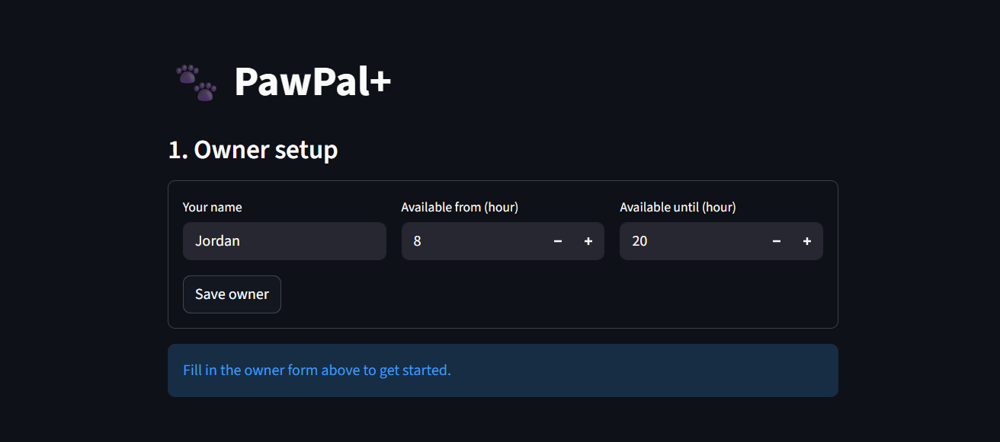

# PawPal+ (Module 2 Project)

A Streamlit app that helps a busy pet owner plan daily care tasks across multiple pets — sorted by priority, filtered by species, and conflict-checked so nothing gets double-booked.

---

## 📸 Demo

<a href="/course_images/ai110/PawPal+.png" target="_blank"></a>



---

## Features

**Priority-based scheduling**
Tasks are ranked `high → medium → low` using a sortable integer mapping. The scheduler always fills high-priority slots first so critical care (medication, feeding) is never pushed out by optional tasks.

**Time-window fitting**
Each owner sets a daily availability window (e.g. 08:00–20:00). The scheduler tracks a running minute pointer and skips any task that would run past the window end — without stopping: smaller tasks behind an oversized one can still be placed.

**Preferred time hints**
Each task can declare a `preferred_hour`. The scheduler advances the clock to that hour if it hasn't passed yet, so "Evening walk" actually lands in the evening. If the preferred hour is already past, the task starts immediately — the clock never rewinds.

**Species filtering**
Tasks can be locked to a species (e.g. `species_filter="cat"`). The scheduler silently excludes them for pets of the wrong species, so a shared task library works cleanly across a multi-pet household.

**Conflict warnings with fix suggestions**
Any task that couldn't be scheduled appears in a collapsible warning panel that explains exactly why — species mismatch, task too long for the whole window, or ran out of time after higher-priority tasks — and suggests what to change.

**Daily recurrence**
Tasks carry a `frequency` label (`daily`, `weekly`, `as-needed`) and a `completed` flag. Calling `reset_day()` sets every task back to pending, so the same task library re-schedules itself each day without manual re-entry.

**Plan caching and cache invalidation**
`build_plan()` caches its result so the scheduling algorithm only runs once per session. Marking a task complete or resetting the day automatically invalidates the cache, so the next call always reflects the current state.

**Inline task completion**
From the schedule view, each task has a one-click "done" button. Completed tasks are removed from the rebuilt plan immediately — no page reload needed.

**Multi-pet aggregation**
The `Owner` class flattens tasks across all pets via `get_all_pending_tasks()`. The `Scheduler` never reaches into individual pet objects directly — it always goes through this method, keeping the data access boundary clean.

---

## Scenario

A busy pet owner needs help staying consistent with pet care. They want an assistant that can:

- Track pet care tasks (walks, feeding, meds, enrichment, grooming, etc.)
- Consider constraints (time available, priority, owner preferences)
- Produce a daily plan and explain why it chose that plan

Your job is to design the system first (UML), then implement the logic in Python, then connect it to the Streamlit UI.

## What you will build

Your final app should:

- Let a user enter basic owner + pet info
- Let a user add/edit tasks (duration + priority at minimum)
- Generate a daily schedule/plan based on constraints and priorities
- Display the plan clearly (and ideally explain the reasoning)
- Include tests for the most important scheduling behaviors

## Getting started

### Setup

```bash
python -m venv .venv
source .venv/bin/activate  # Windows: .venv\Scripts\activate
pip install -r requirements.txt
```

### Run the app

```bash
python -m streamlit run app.py
```

### Suggested workflow

1. Read the scenario carefully and identify requirements and edge cases.
2. Draft a UML diagram (classes, attributes, methods, relationships).
3. Convert UML into Python class stubs (no logic yet).
4. Implement scheduling logic in small increments.
5. Add tests to verify key behaviors.
6. Connect your logic to the Streamlit UI in `app.py`.
7. Refine UML so it matches what you actually built.

---

## Testing PawPal+

Run the full test suite from the project root:

```bash
python -m pytest tests/test_pawpal.py -v
```

Or without pytest installed:

```bash
python tests/test_pawpal.py
```

### What the tests cover

15 tests across two categories:

**Happy paths** — the system doing what it should:
- Adding a task increases the pet's task count
- `mark_complete()` flips a task's status to done
- High-priority tasks are scheduled before low-priority ones
- `get_all_tasks()` correctly aggregates tasks across multiple pets
- `get_available_minutes()` returns the right window size

**Edge cases** — where things could quietly break:
- A pet with no tasks returns an empty plan (no crash)
- An owner with no pets returns an empty plan (no crash)
- A task too long to fit is skipped — shorter tasks still schedule
- A species-filtered task (e.g. dog-only) is excluded from a cat's plan
- `mark_complete()` busts the plan cache so the rebuilt plan is accurate
- A `preferred_hour` already in the past doesn't rewind the clock
- All tasks already completed returns an empty plan
- Plan entries are always in chronological order (no time travel)
- A daily task reappears after `reset_day()` (recurrence logic)
- No two entries share the same start time (no double-booking)

### Confidence level

4 / 5

The core scheduling logic — priority sorting, species filtering, time-window fitting, and cache invalidation — is fully tested and all 15 tests pass. One star held back because there is no test for multi-day recurrence with real dates, and the `preferred_hour` behavior when multiple tasks compete for the same slot could use more coverage.
