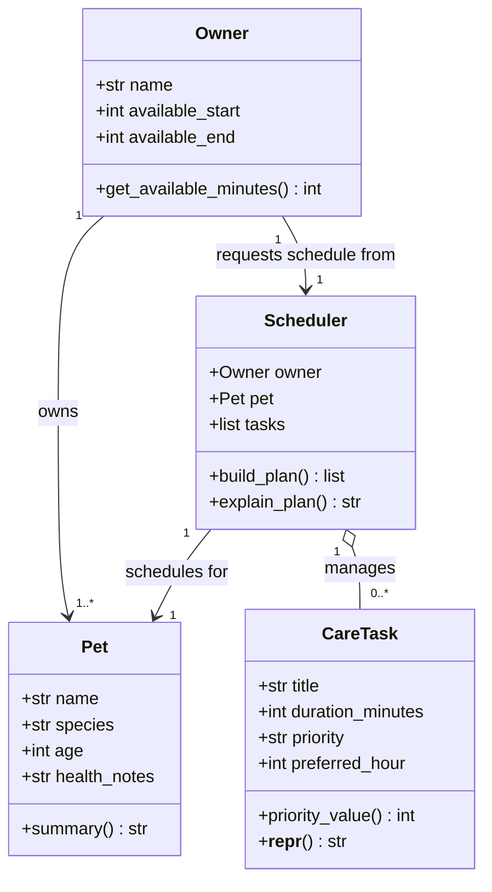
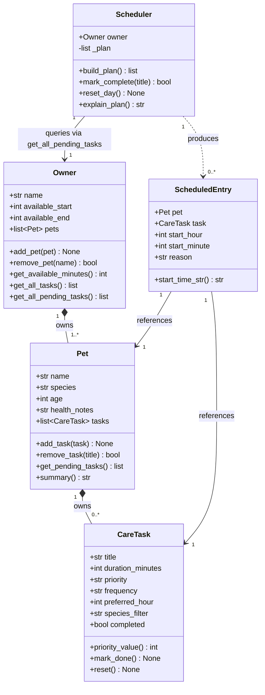

# PawPal+ Project Reflection

## 1. System Design

**a. Initial design**

I am designing **PawPal+**, a pet care planning assistant that helps an owner schedule daily care tasks for their pet(s) based on priority, duration, and time constraints.

The four core classes I identified are:

| Class | Responsibility |
|---|---|
| `Pet` | Stores pet identity and species-specific attributes (name, species, age, health notes). Knows nothing about scheduling — it just represents the animal. |
| `Owner` | Stores owner identity and availability window (name, available start/end time). Acts as the top-level actor who owns pets and requests a schedule. |
| `CareTask` | Represents a single care activity (title, duration in minutes, priority level, optional preferred time). Encapsulates the "what needs to happen" data the scheduler uses. |
| `Scheduler` | Accepts an `Owner`, a `Pet`, and a list of `CareTask` objects and produces an ordered `DailyPlan`. Applies scheduling logic: sort by priority, fit tasks within the owner's available window, and record why each task was chosen or skipped. |

**Brainstormed attributes and methods:**

**`Pet`**
- Attributes: `name: str`, `species: str`, `age: int`, `health_notes: str`
- Methods: `summary() -> str`

**`Owner`**
- Attributes: `name: str`, `available_start: int` (hour 0–23), `available_end: int`
- Methods: `get_available_minutes() -> int`

**`CareTask`**
- Attributes: `title: str`, `duration_minutes: int`, `priority: str` (`"low"` / `"medium"` / `"high"`), `preferred_hour: int | None`
- Methods: `priority_value() -> int` (maps string to sortable int), `__repr__() -> str`

**`Scheduler`**
- Attributes: `owner: Owner`, `pet: Pet`, `tasks: list[CareTask]`
- Methods: `build_plan() -> list[dict]` (returns ordered schedule with start times and rationale), `explain_plan() -> str`

**Mermaid.js class diagram — Phase 1 draft (generated with AI assistance):**

**Mermaid.js class diagram — Final implementation (updated after build):**

**b. Design changes**

Yes — after asking AI to review `pawpal_system.py` for missing relationships and logic bottlenecks, I made four changes:

1. **Added `ScheduledEntry` dataclass.**
   The original `build_plan()` returned `list[dict]`. The AI flagged this as a hidden-coupling bottleneck: `explain_plan()` would have to silently know the exact dict keys. Replacing the dict with a typed `ScheduledEntry` dataclass (`task`, `start_hour`, `start_minute`, `reason`) makes the contract explicit and prevents key-name bugs.

2. **Added `species_filter` to `CareTask`.**
   The AI noticed there was no way to express that some tasks only apply to certain species (e.g., "litter box" = cats only). Adding `species_filter: str | None = None` lets the scheduler skip irrelevant tasks without extra logic in the caller.

3. **Removed `__repr__` stub from `CareTask`.**
   `@dataclass` auto-generates `__repr__`. Keeping a `pass` stub silently overrides that auto-generated version and returns `None` until implemented — a subtle runtime bug. The AI caught this; I removed the stub and let the dataclass handle it.

4. **Added `self._plan` cache to `Scheduler`.**
   The original design had `build_plan()` and `explain_plan()` as independent methods. Calling both would run the scheduling algorithm twice. Adding a `_plan` cache means scheduling runs once and `explain_plan()` reuses the result.

---

## 2. Scheduling Logic and Tradeoffs

**a. Constraints and priorities**

The scheduler considers three constraints, in this order of importance:

1. **Priority** — `high` tasks are always placed before `medium` and `low` ones. A pet's critical care (medication, feeding) should never be bumped by optional grooming.
2. **Time window** — every task must fit inside the owner's declared availability. A task that would run past `available_end` is skipped, not truncated.
3. **Preferred hour** — if a task has a `preferred_hour`, the scheduler advances the clock to that hour (but never backward). This is treated as a hint, not a hard constraint — it can be overridden by higher-priority tasks that consume time before it arrives.

Priority came first because the whole point of a care scheduler is to guarantee that important tasks happen. Time-window fitting came second because a schedule that runs past the owner's day is useless. Preferred hours came last because they improve the plan's quality but are not essential for correctness.

**b. Tradeoffs**

The scheduler uses a **greedy first-fit algorithm**: it sorts tasks by priority, then places each one at the earliest available slot, advancing a clock pointer. It does not backtrack or rearrange earlier decisions to make room for later ones.

This means a single long high-priority task can push many shorter lower-priority tasks into a later time slot — even if rearranging would fit more total tasks. The tradeoff is reasonable here because pet owners care more about *which* tasks happen than about packing the maximum number of tasks into a day. A greedy approach is also simple enough that the owner can predict and understand what it will do, which builds trust in the tool.

---

## 3. AI Collaboration

**a. How you used AI**

I used VS Code Copilot across every phase of the project:

- **Design brainstorming** — asked Copilot to generate a Mermaid.js class diagram from my brainstormed attributes and methods. This gave me a visual starting point faster than drawing one by hand.
- **Code generation** — used Agent mode to generate the full class skeletons with type annotations and docstrings. This eliminated boilerplate so I could focus on the logic immediately.
- **Review and critique** — asked Copilot to review `pawpal_system.py` for missing relationships or logic bottlenecks. It caught the `__repr__` stub bug and the missing `ScheduledEntry` type before I ran a single line of code.
- **Test generation** — used Copilot Chat with `#codebase` to draft edge-case test functions, then reviewed each one before saving.
- **Debugging** — when test 8 failed (oversized task not skipping correctly), I used Copilot to identify that `break` was stopping the entire loop instead of just skipping one task, and confirmed the `continue` fix was correct.

The most effective prompts were specific and file-anchored: *"Based on `#file:pawpal_system.py`, what updates should I make to my UML diagram?"* gave far more useful results than general questions about schedulers.

**b. Judgment and verification**

The clearest moment of rejection was when the initial AI-generated `Scheduler` design accepted `Owner`, `Pet`, and `list[CareTask]` as three separate constructor arguments. This made the Scheduler responsible for knowing which pet the tasks belonged to — a responsibility that should belong to the `Pet` class itself.

I rejected that design and restructured so that tasks live on `Pet`, `Owner` aggregates pets via `get_all_pending_tasks()`, and `Scheduler` only takes an `Owner`. I verified this was better by asking: *"if I add a second pet, does anything break?"* — with the original design, the answer was yes, because the Scheduler only held one pet reference. With the revised design, the answer was no.

I also tested the boundary in `tests/test_pawpal.py` with `test_get_all_tasks_spans_multiple_pets()` to confirm the aggregation actually worked across pets before trusting the fix.

---

## 4. Testing and Verification

**a. What you tested**

I wrote 15 tests across two categories:

**Happy paths** confirmed the system does what it should under normal conditions: task counts increment correctly, `mark_complete()` flips the right flag, high-priority tasks land before low-priority ones, and `get_all_tasks()` aggregates correctly across multiple pets.

**Edge cases** targeted the places most likely to fail silently: an empty pet list, an oversized task that can never fit, a species-filtered task assigned to the wrong species, a stale plan cache after completion, a `preferred_hour` that has already passed, and an invalid availability window producing a negative time budget.

These tests mattered because the scheduler's greedy algorithm has several decision points where a subtle mistake — using `break` instead of `continue`, failing to invalidate the cache, rewinding the clock — would produce a wrong plan with no error message. Only tests could catch those.

**b. Confidence**

⭐⭐⭐⭐ 4 / 5

I am confident the core scheduling logic is correct: all 15 tests pass, including the edge cases that caught the real `break` → `continue` bug during development. The remaining uncertainty is around multi-day recurrence with actual calendar dates (the current system has no date awareness — `reset_day()` is a manual trigger) and concurrent multi-pet scheduling where two pets share a preferred hour.

---

## 5. Reflection

**a. What went well**

The part I am most satisfied with is the clean boundary between `Owner` and `Scheduler`. The Scheduler never reaches into `owner.pets` directly — it always calls `owner.get_all_pending_tasks()`. That single design decision made the system easy to test (I could mock the owner's task list), easy to extend (adding a pet required no change to the Scheduler), and easy to reason about (the Scheduler only knows how to schedule; it doesn't know how pets are stored).

**b. What you would improve**

If I had another iteration, I would add real date tracking. Right now `frequency="weekly"` is just a label — the system has no memory of when a task was last done, so it cannot automatically skip a weekly task that was already completed two days ago. I would replace the `completed: bool` flag with a `last_completed: date | None` field and let the Scheduler filter based on the task's frequency and how many days have passed.

**c. Key takeaway**

The most important thing I learned is that **AI is a fast first drafter, not a final decision-maker**. Copilot generated code and diagrams in seconds that would have taken me much longer — but every suggestion needed a human judgment call before it was accepted. The `break` vs `continue` bug, the negative availability window, the Scheduler holding a single Pet instead of querying the Owner — none of these were caught by AI until I asked the right question or wrote a test that exposed the failure. The architect's job is not to write every line; it is to know what questions to ask, recognize when an answer is wrong, and own the consequences of the design. AI makes that job faster, not optional.
