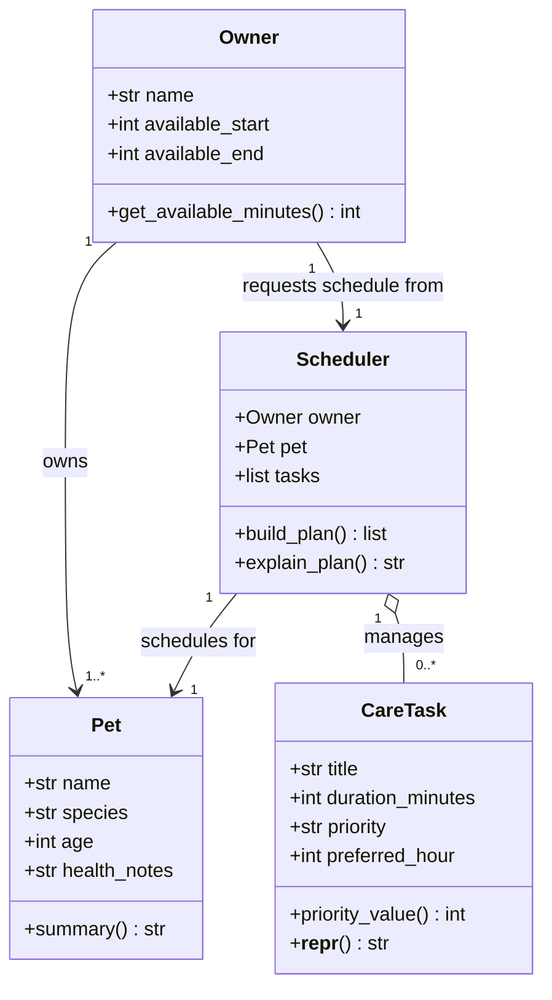

# PawPal+ Project Reflection

## 1. System Design

**a. Initial design**

I am designing **PawPal+**, a pet care planning assistant that helps an owner schedule daily care tasks for their pet(s) based on priority, duration, and time constraints.

The four core classes I identified are:

| Class | Responsibility |
|---|---|
| `Pet` | Stores pet identity and species-specific attributes (name, species, age, health notes). Knows nothing about scheduling — it just represents the animal. |
| `Owner` | Stores owner identity and availability window (name, available start/end time). Acts as the top-level actor who owns pets and requests a schedule. |
| `CareTask` | Represents a single care activity (title, duration in minutes, priority level, optional preferred time). Encapsulates the "what needs to happen" data the scheduler uses. |
| `Scheduler` | Accepts an `Owner`, a `Pet`, and a list of `CareTask` objects and produces an ordered `DailyPlan`. Applies scheduling logic: sort by priority, fit tasks within the owner's available window, and record why each task was chosen or skipped. |

**Brainstormed attributes and methods:**

**`Pet`**
- Attributes: `name: str`, `species: str`, `age: int`, `health_notes: str`
- Methods: `summary() -> str`

**`Owner`**
- Attributes: `name: str`, `available_start: int` (hour 0–23), `available_end: int`
- Methods: `get_available_minutes() -> int`

**`CareTask`**
- Attributes: `title: str`, `duration_minutes: int`, `priority: str` (`"low"` / `"medium"` / `"high"`), `preferred_hour: int | None`
- Methods: `priority_value() -> int` (maps string to sortable int), `__repr__() -> str`

**`Scheduler`**
- Attributes: `owner: Owner`, `pet: Pet`, `tasks: list[CareTask]`
- Methods: `build_plan() -> list[dict]` (returns ordered schedule with start times and rationale), `explain_plan() -> str`

**Mermaid.js class diagram (generated with AI assistance):**

**b. Design changes**

Yes — after asking AI to review `pawpal_system.py` for missing relationships and logic bottlenecks, I made four changes:

1. **Added `ScheduledEntry` dataclass.**
   The original `build_plan()` returned `list[dict]`. The AI flagged this as a hidden-coupling bottleneck: `explain_plan()` would have to silently know the exact dict keys. Replacing the dict with a typed `ScheduledEntry` dataclass (`task`, `start_hour`, `start_minute`, `reason`) makes the contract explicit and prevents key-name bugs.

2. **Added `species_filter` to `CareTask`.**
   The AI noticed there was no way to express that some tasks only apply to certain species (e.g., "litter box" = cats only). Adding `species_filter: str | None = None` lets the scheduler skip irrelevant tasks without extra logic in the caller.

3. **Removed `__repr__` stub from `CareTask`.**
   `@dataclass` auto-generates `__repr__`. Keeping a `pass` stub silently overrides that auto-generated version and returns `None` until implemented — a subtle runtime bug. The AI caught this; I removed the stub and let the dataclass handle it.

4. **Added `self._plan` cache to `Scheduler`.**
   The original design had `build_plan()` and `explain_plan()` as independent methods. Calling both would run the scheduling algorithm twice. Adding a `_plan` cache means scheduling runs once and `explain_plan()` reuses the result.

---

## 2. Scheduling Logic and Tradeoffs

**a. Constraints and priorities**

- What constraints does your scheduler consider (for example: time, priority, preferences)?
- How did you decide which constraints mattered most?

**b. Tradeoffs**

- Describe one tradeoff your scheduler makes.
- Why is that tradeoff reasonable for this scenario?

---

## 3. AI Collaboration

**a. How you used AI**

- How did you use AI tools during this project (for example: design brainstorming, debugging, refactoring)?
- What kinds of prompts or questions were most helpful?

**b. Judgment and verification**

- Describe one moment where you did not accept an AI suggestion as-is.
- How did you evaluate or verify what the AI suggested?

---

## 4. Testing and Verification

**a. What you tested**

- What behaviors did you test?
- Why were these tests important?

**b. Confidence**

- How confident are you that your scheduler works correctly?
- What edge cases would you test next if you had more time?

---

## 5. Reflection

**a. What went well**

- What part of this project are you most satisfied with?

**b. What you would improve**

- If you had another iteration, what would you improve or redesign?

**c. Key takeaway**

- What is one important thing you learned about designing systems or working with AI on this project?
